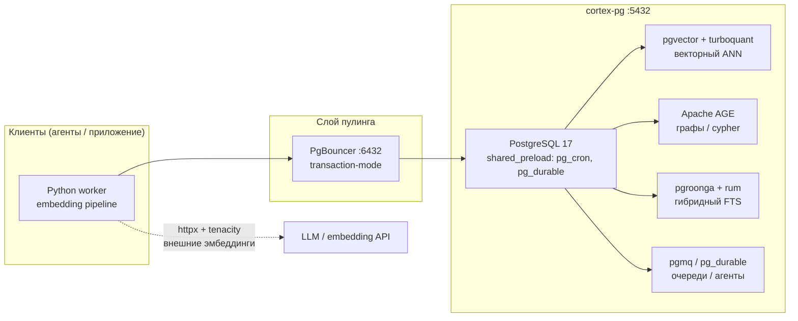

<div align="center">

# cortex-pg

**PostgreSQL 17 Docker-образ для памяти AI-агентов:** векторный + графовый + полнотекстовый поиск в одной БД.

Оптимизирован под **слабые amd64 Linux VPS** — те самые за $5, на которых обычный Postgres умирает от OOM.

[](https://github.com/msmirnyagin/cortex-pg/actions/workflows/build.yml)


</div>

---

## Что это

`cortex-pg` — это «база данных с суперсилой» для RAG/AI-приложений: PostgreSQL, заранее оснащённый расширениями для эмбеддингов (векторный ANN-поиск), графов знаний (Apache AGE, openCypher), гибридного полнотекстового поиска (BM25, триграммы, CJK) и оркестрации агентов (очереди pgmq, cron). Всё в одном контейнере, с двумя преднастроенными профилями ресурсов под железо разного класса.

### Дизайн-принципы

- **Один контейнер — весь стек памяти агента.** Не нужен внешний векторный-DB, графовый-DB, поисковый движок и брокер очередей.
- **Выживание на слабом сервере.** Жёсткие лимиты RAM, минимум воркеров, обязательный PgBouncer.
- **Отказоустойчивая инициализация.** Каждое `CREATE EXTENSION` обёрнуто в `DO/EXCEPTION` — отсутствующее расширение не роняет старт, а пишет `NOTICE`.
- **Предсказуемая сборка.** База `postgres:17-bookworm` + PGDG apt: собирается в CI за минуты, без хрупкого Nix-наследия.

---

## Состав расширений

### Установленные расширения (Stage 1 + Stage 2, проверено в CI)

| Категория | Расширение | Источник | Назначение |
|---|---|---|---|
| **Векторы** | `vector` (pgvector) v0.8.1 | source (пин) | типы `vector`/`halfvec`, индексы hnsw/ivfflat |
| **Векторы** | `pg_turboquant` | source (C) | компактный ANN-индекс (×3–4 меньше HNSW) |
| **Поиск** | `pg_search` v0.24.1 | .deb (ParadeDB) | BM25 (Tantivy) |
| **Поиск** | `pgroonga` | apt (Groonga) | мультиязычный FTS, особенно CJK |
| **Поиск** | `rum` | apt (PGDG) | tsvector + recency без heap scan |
| **Поиск** | `pg_trgm`, `btree_gin`, `btree_gist` | contrib | триграммы, гибридные индексы |
| **Графы / API** | `age` (Apache AGE) | apt (PGDG) | openCypher через `cypher()`, тип `agtype` |
| **Графы / API** | `pg_graphql` | pgrx/Rust | GraphQL-резолвер |
| **Графы / API** | `http` | apt (PGDG) | синхронные HTTP-запросы из SQL |
| **Графы / API** | `pg_net` | source (C) | асинхронные HTTP (webhooks) |
| **Безопасность** | `pgcrypto` | contrib | digest/hmac, bcrypt, PGP |
| **Безопасность** | `pg_jsonschema` | pgrx/Rust | `json_matches_schema()` |
| **Безопасность** | `supabase_vault` v0.3.1 | source (C) | шифрованное хранилище секретов (vault.secrets) |
| **Оркестрация** | `pg_cron` | apt (PGDG) | cron-задачи внутри БД |
| **Оркестрация** | `pg_durable` v0.2.2 | .deb (Microsoft) | durable-функции/агенты |
| **Оркестрация** | `pgmq` | SQL/PGXS | SQL-очередь (брокер для агентов) |
| **Оркестрация** | `pg_hint_plan` | apt (PGDG) | хинты плана запроса |
| **Оркестрация** | `hypopg` | apt (PGDG) | виртуальные индексы (cost-оценка) |
| **Оркестрация** | `index_advisor` | SQL/PGXS | советник по индексам |
| **Гео** | `postgis` *(opt-in)* | apt (PGDG) | геозоны, `ST_DWithin`, GiST по lat/lon |
| **Языки** | `plpython3u` | apt (Debian) | Python в БД + `baml-py` |

### Источники установки

Все расширения установлены. По способу установки: `.deb` (pg_durable, pg_search), apt/PGDG (age, pg_cron, hypopg, http, pg_hint_plan, rum, postgis), apt/Groonga (pgroonga), source C/PGXS (pgvector, pg_turboquant, pg_net, supabase_vault), SQL/PGXS (pgmq, index_advisor), pgrx/Rust (pg_jsonschema, pg_graphql), pip (baml-py).

> **PostGIS — опциональный (opt-in).** Пакет в образе для обоих тиров, но `CREATE EXTENSION postgis` выполняется по требованию (в схеме `geo`) и не входит в базовые миграции `init.sql`. Preload не нужен — в простое не потребляет RAM. Назначение: location-aware агенты (геозоны, близость, `ST_DWithin`, пространственные GiST-индексы).

> **supabase_vault:** для шифрования секретов требует корневой ключ. Образ содержит getkey-скрипт, который генерирует HEX-ключ (32 байта) при первом старте и хранит его в PGDATA (`$PGDATA/vault_root.key`). Ключ грузится при старте **только** если `supabase_vault` в `shared_preload_libraries` (иначе `_PG_init` не выполнит загрузку ключа). Ключ персистентен в рамках одного data-тома — при пересоздании тома генерируется новый.
>
> `pgsodium` намеренно убран (Supabase не рекомендует новые инсталляции, deprecated). Vault v0.3.1 самодостаточен: C/PGXS, линкует libsodium напрямую, не зависит от pgsodium.

---

## Тиры серверов

Образ собирается с build-arg `CORTEX_TIER`, который подставляет готовый профиль ресурсов.

| Параметр | Tier 1 `min` (1 ГБ / 1 CPU) | Tier 2 `max` (2 ГБ / 4 CPU) |
|---|---|---|
| `shared_buffers` | 192 МБ | 512 МБ |
| `max_connections` | 12 | 25 |
| Параллелизм | выкл (1 CPU) | 2 воркера на gather |
| `shared_preload_libraries` | `supabase_vault` | `pg_cron, pg_durable, pg_search, supabase_vault, pg_net` |
| Назначение | эконом-режим, оркестрация в приложении | полный стек |

На обоих tier-ах поверх Postgres **обязательно** поднимается PgBouncer (transaction-mode), чтобы защитить сервер от коннект-штормов агентов.

---

## Быстрый старт

Образ публикуется в GHCR при каждом пуше в `main`:

```bash
docker pull ghcr.io/msmirnyagin/cortex-pg:latest
```

Запуск Tier 2 (по умолчанию):

```bash
docker run -d --name cortex-pg \
  -p 5432:5432 \
  -e POSTGRES_PASSWORD=secret \
  -v cortex-pg-data:/var/lib/postgresql/data \
  ghcr.io/msmirnyagin/cortex-pg:latest
```

При первом старте автоматически выполняются миграции (`init.sql` → `sql/00…99`), создающие все доступные расширения. Список установленных расширений выводится в лог.

> **Теги:** `latest`, `main`, семвер (`v1.0.0`, `1.0`), и `sha-<short>`. Tier выбирается только при сборке (CI `workflow_dispatch` или локально).

---

## Архитектура



**Ключевые архитектурные решения:**

- **PgBouncer как обязательный sidecar.** Соединения пулируются в transaction-mode (8 коннектов на БД + резерв). Сами миграции и `SET`/prepared statements между транзакциями не держатся.
- **Очереди = pgmq (SQL-only).** Нет отдельного брокера; сложный retry/branching живёт в Python-воркере (`httpx` + `tenacity`), а не в БД.
- **Embedding-pipeline — внешний.** pg_net зарезервирован только под webhooks; сами эмбеддинги считает внешний Python-воркер, пишущий векторы обратно через пул.

---

## Структура репозитория

```
cortex-pg/
├── Dockerfile                 # Сборка Stage 1+2: apt/PGDG + source C + .deb + pgrx/Rust
├── init.sql                   # Оркестратор миграций (порядок по зависимостям)
├── sql/
│   ├── 00-base.sql            # contrib: pgcrypto, pg_trgm, btree_gin/gist...
│   ├── 01-vectors.sql         # vector → pg_turboquant (порядок критичен!)
│   ├── 02-validation-security.sql  # vault, jsonschema (pgsodium убран)
│   ├── 03-search.sql          # pgroonga, pg_search, rum
│   ├── 04-graph-api-net.sql   # age, pg_graphql, pg_net, http
│   ├── 05-orchestration-tuning.sql # pg_cron, pgmq, pg_durable, hint_plan
│   ├── 06-lang-ai.sql         # plpython3u (BAML)
│   └── 99-verify.sql          # отчёт об установленных расширениях
├── config/
│   ├── postgresql-min.conf    # Tier 1 (1 ГБ)
│   ├── postgresql-max.conf    # Tier 2 (2 ГБ)
│   ├── pgbouncer.ini          # конфиг sidecar-пулера
│   └── pgbouncer-userlist.txt # userlist (gitignored — нет секретов)
└── .github/workflows/build.yml
```

---

## Сборка и CI

Сборка идёт на нативном amd64-раннере (`ubuntu-latest`) — без QEMU/Rosetta, что критично для тяжёлых C/Rust-сборок. Триггеры:

- **push в `main`** (при изменении `Dockerfile`, `init.sql`, `sql/`) → тег `latest` + `sha-<short>`
- **тег `v*`** → семверные теги (`v1.0.0`, `1.0`)
- **`workflow_dispatch`** → ручной запуск с выбором tier (`min` / `max`)

Кэш сборки — через GitHub Actions cache (`type=gha`). Авторизация в GHCR — встроенным `GITHUB_TOKEN`, без дополнительных секретов.

Локальная сборка (напр. Tier 1):

```bash
docker build --build-arg CORTEX_TIER=min -t cortex-pg:min .
```

> ⚠️ `pg_durable` распространяется как amd64 `.deb` — локальная сборка на Apple Silicon (arm64) упадёт на этом шаге. Для arm64-дева сборка из исходников будет добавлена позже; production-таргет всё равно amd64.

---

## Roadmap

- [x] **Stage 1** — надёжная база: apt + source + `.deb`, CI зелёный
- [x] **Stage 2** — pgrx/Rust (pg_jsonschema, pg_graphql) + pg_search/pgmq/pg_net/index_advisor/vault; preload восстановлен
- [x] **Тесты** — smoke-тест в CI: старт контейнера + проверка расширений + раунд-трип vault.create_secret
- [x] **PostGIS** — opt-in гео-расширение для location-aware агентов (apt, без preload)
- [x] **Надёжный CI** — генерация тегов без API-запросов (устойчив к сбоям GitHub), actions на Node 24
- [ ] **arm64** — source-build `pg_durable`/`pg_search` для локальной разработки на Apple Silicon
- [ ] ** HEALTHCHECK + docker-compose** — готовый compose с PgBouncer sidecar

---

## Источники и исследование

Подробный каталог всех ~20 рассматривавшихся расширений (источник установки, preload-требования, версии, дедупликация перекрывающегося функционала) собран в `.ext-research/00-catalog.md` и сопутствующих заметках.
